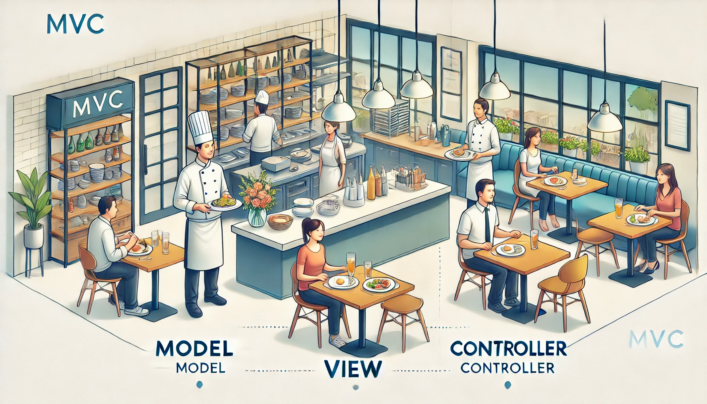

# Analogi MVC (Model-View-Controller)

Untuk memahami konsep **MVC** (Model-View-Controller), mari kita gunakan analogi **restoran** yang sederhana, di mana setiap bagian dari restoran mewakili salah satu komponen dalam MVC.

### **1. Model (M): Chef di Dapur**
Model adalah bagian yang berurusan dengan **data** dan **logika bisnis** aplikasi. Dalam analogi restoran, ini adalah **chef** yang bekerja di dapur.

- **Tugas Chef**: Chef menerima pesanan (data dari pengguna) dan menyiapkan makanan sesuai dengan pesanan tersebut (mengolah data). Setelah makanan selesai, chef memberikan makanan tersebut kepada pelayan untuk disajikan ke pelanggan.
- **Dalam Aplikasi**: Model bertanggung jawab untuk mengambil, memanipulasi, dan menyimpan data. Misalnya, jika kita memiliki aplikasi manajemen mahasiswa, model akan berfungsi untuk mengambil data mahasiswa dari database, menyimpannya, atau mengubahnya sesuai dengan permintaan.

### **2. View (V): Pelayan Restoran**
View adalah bagian yang bertanggung jawab untuk **menampilkan data** kepada pengguna. Dalam restoran, ini adalah **pelayan** yang menyajikan makanan ke meja pelanggan.

- **Tugas Pelayan**: Pelayan menerima makanan dari chef dan menyajikannya di meja pelanggan, sesuai dengan pesanan pelanggan.
- **Dalam Aplikasi**: View akan menerima data dari model dan menampilkannya kepada pengguna dalam bentuk yang mudah dipahami. Misalnya, dalam aplikasi manajemen mahasiswa, view akan menampilkan daftar mahasiswa dalam bentuk tabel atau kartu.

### **3. Controller (C): Kasir/Pelayan yang Menerima Pesanan**
Controller adalah penghubung antara **Model** dan **View**. Controller yang menerima **perintah dari pengguna**, mengolah data yang diperlukan, dan kemudian menginstruksikan model untuk memproses data tersebut. Setelah itu, controller mengarahkan hasilnya ke view untuk ditampilkan.

- **Tugas Kasir/Pelayan**: Ketika pelanggan datang ke restoran dan ingin memesan, mereka akan memberikan pesanan kepada kasir atau pelayan. Pelayan kemudian akan membawa pesanan itu ke dapur (model), dan setelah makanan siap, pelayan menyajikannya ke meja pelanggan.
- **Dalam Aplikasi**: Controller menerima permintaan dari pengguna (misalnya, klik tombol atau form submit), mengolah input tersebut, meminta model untuk memproses data, dan akhirnya menampilkan hasilnya ke view. Jika pengguna ingin menambah data mahasiswa, controller akan menangani input form dan menginstruksikan model untuk menyimpan data, kemudian menampilkan hasilnya di view.

### **Bagaimana MVC Bekerja Bersama-sama?**
- **Pengguna (Pelanggan)** datang ke restoran dan memberi **pesanan** (input data) kepada **pelayan** (controller).
- **Pelayan** (controller) lalu mengarahkannya ke **chef** (model) untuk mempersiapkan **makanan** (data).
- Setelah **makanan** siap, **pelayan** (controller) membawa makanan itu dan **menyajikan** kepada pelanggan (view).
- Pelanggan sekarang dapat menikmati makanannya (melihat data).

### **Contoh dalam Aplikasi:**
Misalkan kamu memiliki aplikasi **manajemen mahasiswa**.

1. **Model (Chef)**:
   - Model akan mengakses database untuk mengambil data mahasiswa. Misalnya, data mahasiswa dengan nama, jurusan, dan alamat.
   - Model juga bisa menangani operasi lain seperti menambahkan, mengedit, atau menghapus data mahasiswa.
   
2. **View (Pelayan)**:
   - View akan menampilkan data mahasiswa dalam bentuk tabel atau daftar. Ini adalah apa yang dilihat oleh pengguna di layar.
   
3. **Controller (Kasir/Pelayan yang Menerima Pesanan)**:
   - Controller akan menerima permintaan dari pengguna. Misalnya, ketika pengguna ingin melihat daftar mahasiswa, controller akan meminta model untuk mengambil data mahasiswa, kemudian mengarahkan data itu ke view untuk ditampilkan.
   - Jika pengguna ingin menambahkan mahasiswa baru, controller akan menerima data dari form, mengirimkannya ke model untuk diproses, dan akhirnya mengarahkan view untuk memperbarui tampilan.

### **Keuntungan MVC:**
- **Pemisahan Tugas**: MVC membantu memisahkan logika aplikasi (model), antarmuka pengguna (view), dan kontrol alur aplikasi (controller). Hal ini membuat kode lebih **terorganisir** dan **mudah dikelola**.
- **Pemeliharaan Lebih Mudah**: Jika ada yang perlu diubah di tampilan (misalnya, desain UI), kita hanya perlu mengubah bagian view tanpa mempengaruhi logika atau data.
- **Scalability**: Dengan MVC, kita bisa mengembangkan aplikasi lebih mudah karena setiap komponen (model, view, controller) bisa dikelola secara terpisah.
  
